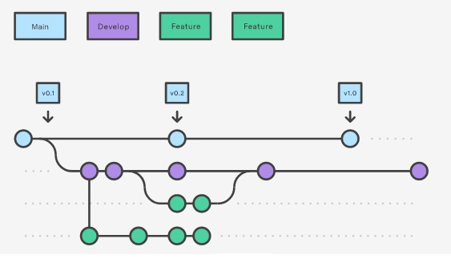

# Convenções de código, dados e metadados

Este capítulo fornece convenções de código e dados para os projetos analíticos da empresa [**re.green**](https://www.re.green/). Para informações adicionais, consulte o time de inteligência de dados: [Sara Mortara](mailto:sara.mortara@re.green), [Felipe Bocca](mailto:felipe.bocca@re.green) ou [Nathalia Monalisa](mailto:nathalia.monalisa@re.green).

## Convenções de código

### Geral 

Os projetos da **re.green** são normalmente desenvolvidos na linguagem R e seguem o padrão de estilo
do [tidyverse](https://style.tidyverse.org). É possível utilizar o pacote [styler](https://styler.r-lib.org/index.html) para formatar e checar a consistência do código em relação ao padrão desejado.

As principais regras de estilo a serem seguidas estão descritas abaixo:

- Disposição do código
    - [Espaçamento](https://style.tidyverse.org/syntax.html#spacing)
    - [Tamanho Máximo de Linha](https://style.tidyverse.org/syntax.html#long-lines)
    - [Organização interna](https://style.tidyverse.org/files.html#internal-structure)
- [Símbolo de atribuição](https://style.tidyverse.org/syntax.html#assignment)
- [Uso de Aspas](https://style.tidyverse.org/syntax.html#character-vectors)
- [Comentários](https://style.tidyverse.org/syntax.html#comments)
- Convenção de nomes
    - [Nomes de Arquivos](https://style.tidyverse.org/files.html#names)
    - [Nomes de Variáveis](https://style.tidyverse.org/syntax.html#object-names) seguindo snake_case
- Indicação de localização dos arquivos: sempre que possível, usar caminhos relativos
- [Regras gerais para funções](https://style.tidyverse.org/functions.html)

Além das regras de definição de funções descritas no tópico acima, é necessário que todas elas estejam documentadas seguindo o padrão [**roxygen2**](https://cran.r-project.org/web/packages/roxygen2/vignettes/roxygen2.html), incluindo funções auxiliares. Cada função deve estar em um arquivo separado. Além disso, as funções devem conter controle de fluxo e exceções com blocos `tryCatch()`. 

Para ver um exemplo de função documentada, cheque o [guia de estilo do tidyverse](https://style.tidyverse.org/documentation.html).
Ou consulte o nosso [repositório de exemplos](https://github.com/R-egreen/example_regreen). 

## Dependência de pacotes
  Para gerenciamento de dependências, deve-se utilizar o pacote [**renv**](https://rstudio.github.io/renv/articles/renv.html) para referenciar todas as bibliotecas utilizadas no projeto e suas respectivas versões.

## Repositórios de código

### Geral

Para entrega de produtos que envolvam código, os arquivos deverão ser entregues em um repositório no github da empresa.  O link será fornecido e será dada autorização para inclusão de colaboradores(as) com papel de escrita.

O repositório também deve conter um README.md detalhado, informando:
  - contexto do projeto
  - árvore com a estrutura de arquivos/diretórios do bucket de armazenamento dos dados na nuvem (ver seção **Entrega de dados**)
  - link do bucket de armazenamento dos dados na nuvem
  - indicação das funções onde cada conjunto de dados é inputado
  - desenvolvedores do projeto e contato (e-mail)
  
### Conteúdo do repositório

Seguir estrutura de pastas de acordo com a definição abaixo: 

    .
    ├── README.md # contém intruções gerais para uso 
    ├── renv.lock* # contém dependências
    ├── script/ # contém scripts de exemplo de chamada das funções
    └── functions/ # contém funções documentadas, cada função em um arquivo separado

### Versionamento

A ramificação principal deve ser a `main` e armazenar a base de código principal, estando sempre funcional (sem código quebrado). Em relação ao fluxo de versionamento, sugerimos o Gitflow. Nele o desenvolvimento deve ser encapsulado em um ramo `dev` que funciona como pai para as ramificações de features e hot-fix. Uma vez que o ramo `dev` tenha adquirido código novo o suficiente para que o produto seja considerado uma nova versão, deve-se fazer o merge com o ramo principal `main`.

Para mais informações, consulte o [**tutorial**](https://www.atlassian.com/br/git/tutorials/comparing-workflows/gitflow-workflow) e veja a figura abaixo que ilustra a ideia básica do gitflow:

## Padrão de metadados

Todo conjunto de dados deve apresentar um arquivo de metadados associado com informações que descrevem o conjunto, de acordo com o padrão abaixo. Para ver exemplos, consulte a pasta `metadata/` no nosso [repositório de exemplos](https://github.com/R-egreen/example_regreen). 

### 1 - Dados tabulares: 
Metadado no formato .csv seguindo o padrão:

- Nome da variável
- Descrição da variável
- Tipo de dado da variável
- Exemplo da variável

Exemplo:

Variável | Descrição | Tipo de dado | Exemplo
--------:|--------:| --------:|--------:
Gênero| Gênero da espécie | caractere | Schinus
Forma de vida | Descrição da forma de vida da espécie | caractere | árvore; epífita 

### 2- Dados espaciais
Metadado no formato .txt ou .xml seguindo o padrão:

- 2.1.Shapefile
  - Tipo: classe geométrica do objeto (ponto, linha ou polígono)
  - Sistema de coordenadas (CRS): método de projeção dos dados  
  - Escala: relação entre a distância no mapa/arquivo e a distância no chão
  - Atributos: nome das colunas que descrevem os elementos registrados nas linhas do arquivo
  
- 2.2.Raster
  - Tipo: classe do objeto importado (RasterLayer, RasterStack ou RasterBrick)
  - Extensão: cobertura geográfica total ocupada pelo objeto espacial (xmin, xmax, ymin, ymax)
  - Sistema de coordenadas (CRS): método de projeção dos dados
  - Resolução: área real coberta por cada pixel
  - Colunas: número de colunas
  - Valores: número de registros
  
  
## Entrega dos dados

Todos os dados e metadados de um produto devem ser armazenados em um [bucket AWS](https://aws.amazon.com/pt/s3/), cujo link será disponibilizado pela re.green. É absolutamente necessário que os diretórios estejam organizados, seguindo uma hierarquia lógica, sem arquivos misturados às pastas. 

Abaixo segue uma sugestão de árvore de diretórios, mas mudanças podem ser implementadas se ajudam a refinar a organização da estrutura:

    .
    |__ project_name 
    |   |__ data
    |       |__ csv
    |       |   |____ file1.csv
    |       |   |____ file2.csv
    |       | 
    |       |__ rasters
    |       |   |____ file3.tif
    |       |
    |       |__ shapes
    |       |   |____ file4.shp
    |       |
    |       |__ metadata
    |           |____ metadata_file1.csv
    |           |____ metadata_file2.csv
    |           |____ metadata_file3.txt
    |           |____ metadata_file4.txt

